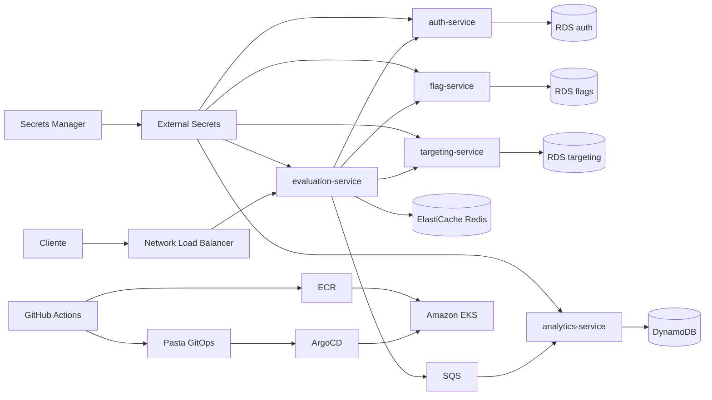

# ToggleMaster — Tech Challenge Fase 3

O ToggleMaster é uma plataforma de *feature flags*: ela permite ativar ou desativar funcionalidades e definir regras de liberação sem publicar uma nova versão da aplicação.

Nesta fase, os cinco microsserviços criados anteriormente foram integrados a uma plataforma completa de infraestrutura como código, DevSecOps, containers, Kubernetes e GitOps. Todo o ambiente de homologação é descrito em Terraform, as imagens passam por verificações de segurança antes da publicação e o ArgoCD mantém o Amazon EKS sincronizado com o estado declarado no Git.

## Arquitetura



### Microsserviços

| Serviço | Tecnologia | Porta local | Responsabilidade |
|---|---|---:|---|
| `auth-service` | Go | 8001 | Criação e validação de chaves de API |
| `flag-service` | Python/Flask | 8002 | Cadastro e manutenção das feature flags |
| `targeting-service` | Python/Flask | 8003 | Regras de segmentação e liberação |
| `evaluation-service` | Go | 8004 | Avaliação das flags, cache Redis e publicação no SQS |
| `analytics-service` | Python/Flask | 8005 | Consumo do SQS e gravação dos eventos no DynamoDB |

O fluxo integrado valida uma chave, cria uma flag, configura uma regra, avalia um usuário, publica um evento no SQS e confirma a gravação desse evento no DynamoDB.

## Infraestrutura AWS

O Terraform provisiona os seguintes componentes na região `us-east-1`:

- uma VPC distribuída em duas zonas de disponibilidade;
- duas subnets públicas e duas privadas;
- Internet Gateway, tabelas de rotas e um NAT Gateway;
- um cluster Amazon EKS com Managed Node Group;
- dois nodes EC2 `t3.medium`, com mínimo de um e máximo de três;
- três instâncias PostgreSQL `db.t3.micro` no Amazon RDS;
- um node Redis `cache.t3.micro` no Amazon ElastiCache;
- uma tabela DynamoDB no modo sob demanda;
- uma fila SQS Standard e uma fila de mensagens não processadas (DLQ);
- cinco repositórios privados e imutáveis no Amazon ECR;
- cinco secrets no AWS Secrets Manager;
- ArgoCD, External Secrets Operator e Metrics Server instalados por Helm.

Os nodes, bancos e Redis ficam nas subnets privadas. O serviço de avaliação é publicado por um Network Load Balancer.

O projeto utiliza a `LabRole` fornecida pelo AWS Academy. O Terraform não cria roles nem policies IAM.

## Organização do repositório

```text
.
├── .github/workflows/       # pipelines dos serviços e workflow reutilizável
├── analytics-service/       # worker de analytics
├── auth-service/            # autenticação e chaves de API
├── evaluation-service/      # avaliação das feature flags
├── flag-service/            # cadastro das flags
├── targeting-service/       # regras de segmentação
├── gitops/                  # manifests Kubernetes e aplicações do ArgoCD
├── infra/                   # Terraform e seus módulos
├── scripts/                 # automações locais, AWS e GitOps
├── docs/                    # relatório, guia e evidências
├── docker-compose.yml       # ambiente local completo
└── Makefile                 # comandos de desenvolvimento e validação
```

## Pré-requisitos

Para a execução local:

- Git;
- Docker com Docker Compose;
- `curl`;
- `make`.

Para utilizar o ambiente AWS:

- sessão ativa no AWS Academy;
- AWS CLI;
- `kubectl`;
- acesso ao Docker, utilizado pelo wrapper do Terraform.

O Terraform não precisa estar instalado diretamente na máquina, pois o script `scripts/terraform-docker.sh` utiliza uma imagem oficial.

## Executar localmente

Suba todos os microsserviços e suas dependências:

```bash
make local-up
```

Confirme os cinco health checks:

```bash
make health
```

Execute o fluxo integrado:

```bash
make e2e
```

Execute as verificações separadamente:

```bash
make test
make lint
make sast
make sca
make terraform-check
```

Encerre o ambiente local:

```bash
make local-down
```

O Docker Compose utiliza PostgreSQL, Redis, ElasticMQ como implementação local do SQS e DynamoDB Local. Assim, o fluxo pode ser validado sem consumir recursos da AWS.

## Credenciais temporárias do AWS Academy

As credenciais devem ser copiadas para o arquivo local `credentials_aws_academy.txt`. Esse arquivo está no `.gitignore` e nunca deve ser versionado.

Carregue a sessão no terminal:

```bash
source scripts/aws-academy-env.sh
```

As credenciais do Academy expiram. Depois de iniciar uma nova sessão, substitua o conteúdo do arquivo e execute o comando novamente.

## Terraform

### Configuração

Crie o arquivo de variáveis local a partir do exemplo:

```bash
cp infra/terraform.tfvars.example infra/terraform.tfvars
```

O arquivo `infra/terraform.tfvars` é ignorado pelo Git. A configuração padrão utiliza recursos pequenos para homologação.

### Backend remoto

O `terraform.tfstate` é armazenado em um bucket S3 com criptografia, versionamento, bloqueio de acesso público e arquivo de lock. O bucket precisa existir antes da primeira inicialização.

```bash
source scripts/aws-academy-env.sh

./scripts/terraform-docker.sh init \
  -backend-config="bucket=<BUCKET_DO_STATE>"
```

### Provisionamento em duas etapas

Na primeira execução, mantenha `install_platform = false` em `infra/terraform.tfvars` e crie a infraestrutura base:

```bash
./scripts/terraform-docker.sh plan
./scripts/terraform-docker.sh apply
```

Quando o EKS estiver ativo, altere para `install_platform = true` e aplique novamente. Essa segunda etapa instala ArgoCD, External Secrets e Metrics Server:

```bash
./scripts/terraform-docker.sh plan
./scripts/terraform-docker.sh apply
```

Para confirmar que o código corresponde ao ambiente provisionado:

```bash
./scripts/terraform-docker.sh plan
```

O resultado esperado depois do provisionamento é `No changes`.

## Conectar ao Amazon EKS

```bash
aws eks update-kubeconfig \
  --region us-east-1 \
  --name togglemaster-cluster

kubectl get nodes
```

Por causa das limitações de IAM do AWS Academy, as credenciais temporárias usadas pelo External Secrets e pelos serviços que acessam SQS e DynamoDB precisam ser sincronizadas após cada renovação do laboratório:

```bash
./scripts/sync-academy-k8s-credentials.sh
```

Esse processo cria ou atualiza apenas Secrets dentro do cluster; nenhuma credencial é salva nos manifests do Git.

## CI/CD e DevSecOps

Cada microsserviço possui seu próprio workflow em `.github/workflows/`. As etapas compartilhadas estão em `reusable-service-ci.yml`.

| Etapa | Ferramentas | Comportamento |
|---|---|---|
| Testes | `go test` e `pytest` | Valida o comportamento dos serviços |
| Lint | `golangci-lint` e `ruff` | Verifica qualidade e padrões do código |
| SAST | `gosec` e `bandit` | Procura problemas de segurança no código-fonte |
| SCA | Trivy filesystem | Analisa vulnerabilidades nas dependências |
| Build | Docker | Constrói a imagem do microsserviço |
| Container scan | Trivy image | Bloqueia vulnerabilidades críticas corrigíveis |
| Publicação | Amazon ECR | Publica somente em push aprovado na `main` |
| GitOps | Git e Kustomize | Atualiza o manifest com o SHA publicado |

Pull Requests executam todas as validações, mas não publicam imagens. Um push aprovado na `main` publica a imagem no ECR com o SHA completo do commit e cria automaticamente a atualização GitOps.

A tag `latest` não é utilizada nos deployments.

## GitOps e ArgoCD

Os manifests Kubernetes estão em `gitops/`. Cada microsserviço possui Deployment, Service e configuração Kustomize próprios.

Cadastre a aplicação raiz do ArgoCD:

```bash
kubectl apply -f gitops/argocd/root-application.yaml
kubectl get applications -n argocd
```

Abra a interface local:

```bash
kubectl port-forward svc/argocd-server -n argocd 8080:80
```

Acesse `http://localhost:8080`. A senha inicial deve ser consultada diretamente no cluster e nunca incluída no repositório ou em uma gravação.

O fluxo de entrega é:

1. o pipeline valida o código e a imagem;
2. a imagem aprovada é publicada no ECR com o SHA do commit;
3. o pipeline atualiza `gitops/apps/<serviço>/kustomization.yaml`;
4. o ArgoCD detecta o novo commit;
5. o ArgoCD sincroniza automaticamente o EKS.

## Validar o ambiente AWS

Verifique os componentes principais:

```bash
kubectl get nodes
kubectl get applications -n argocd
kubectl get deployments -n togglemaster
kubectl get pods -n togglemaster -o wide
kubectl get services -n togglemaster
```

Execute o teste E2E diretamente na AWS:

```bash
source scripts/aws-academy-env.sh
./scripts/comprovacao-aws-e2e.sh
```

O script:

1. valida as ferramentas e a sessão do AWS Academy;
2. verifica nodes, deployments e pods;
3. testa a saúde dos cinco microsserviços;
4. cria ou atualiza uma feature flag;
5. configura uma regra de liberação para 100% dos usuários;
6. avalia um usuário único e confirma o resultado positivo;
7. verifica a publicação do evento no SQS;
8. confirma o consumo pelo serviço de analytics;
9. localiza o evento correspondente no DynamoDB.

O resultado esperado é:

```text
Teste E2E AWS: APROVADO.
```

## Segurança

- credenciais, states, planos Terraform e arquivos locais de variáveis são ignorados pelo Git;
- bancos e Redis não são expostos publicamente;
- senhas e chaves ficam no AWS Secrets Manager;
- o External Secrets entrega valores ao Kubernetes sem secrets em YAML;
- imagens executam como usuário não root, sem elevação de privilégios e com capabilities removidas;
- imagens são identificadas pelo SHA imutável do commit;
- SAST, SCA e scan de container fazem parte do pipeline;
- vulnerabilidades críticas corrigíveis impedem a publicação da imagem;
- o deploy é realizado pelo ArgoCD, sem `kubectl apply` no pipeline.

## Estimativa de custos

A estimativa do ambiente de homologação foi criada no AWS Pricing Calculator para a região `us-east-1`. Os arquivos exportados e o print do resumo estão disponíveis na documentação da entrega.

- custo inicial estimado: **US$ 180,00**;
- custo mensal estimado: **US$ 397,90**;
- custo total estimado para 12 meses: **US$ 4.954,80**.

Esses valores são apenas uma referência de planejamento e podem variar conforme preços, tráfego e consumo real.

## Documentação e evidências

- [Relatório de entrega](docs/RELATORIO_ENTREGA.md)
- [Guia de comprovações](docs/GUIA_COMPROVACOES_FASE_03.md)
- [Evidências textuais e visuais](docs/evidencias/)
- [Estimativa do AWS Pricing Calculator em PDF](<docs/ToggleMaster - Homologacao.pdf>)
- [Estimativa detalhada em JSON](<docs/evidencias/ToggleMaster - Ambiente de Homologação AWS.json>)

## Encerramento do ambiente

Somente destrua os recursos depois de concluir a gravação, salvar as evidências e exportar o relatório final:

```bash
source scripts/aws-academy-env.sh
./scripts/terraform-docker.sh plan -destroy
./scripts/terraform-docker.sh destroy
```

Revise o plano antes de confirmar. O bucket que armazena o state deve ser removido apenas depois que os demais recursos forem destruídos corretamente.
